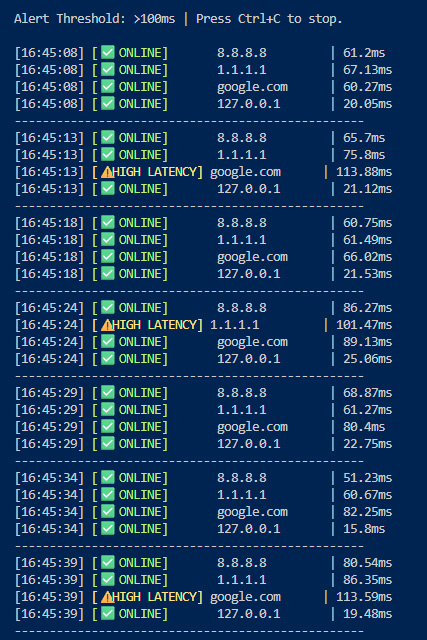
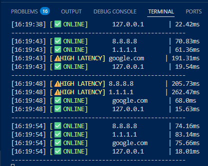

# 🛡️ Cybersecurity Projects Collection

This repository contains a collection of simple Python scripts designed to practice fundamental cybersecurity concepts, scripting, and development logic.

---

## 📚 Project List

### 1. Basic Log Analysis Utility (Project #6)
* **Purpose:** A Python script utilizing the `re` (Regex) module and a dictionary to analyze simulated web server log files for signs of suspicious activity, such as repeated login failures (forensics).
* **Location:** [`log-analyzer/log_parser.py`](./log-analyzer/log_parser.py)

### 2. Simple Packet Analyzer (Project #5)
* **Purpose:** A Python script utilizing the built-in `scapy` library to capture, inspect, and analyze network packets (TCP, UDP, ICMP) to demonstrate basic network monitoring and reconnaissance.
* **Location:** [`packet-analyzer/analyzer.py`](./packet-analyzer/analyzer.py)

### 3. Simple Hashing Utility (Project #4)
* **Purpose:** A Python script utilizing the `hashlib` library to generate secure SHA-256 hashes of input strings. It demonstrates the use of **salting**—a critical security technique—to protect against rainbow table attacks.
* **Location:** [`hashing-utility/hasher.py`](./hashing-utility/hasher.py)

### 4. Simple Port Scanner (Project #2)
* **Purpose:** A Python script utilizing the built-in `socket` module to scan a target IP or hostname for commonly open TCP ports (22, 80, 443, etc.). This demonstrates basic network reconnaissance and socket programming.
* **Location:** [`port-scanner/simple_scanner.py`](./port-scanner/simple_scanner.py)

### 5. Password Checker Assistant (Project #1)
* **Purpose:** A Python script that checks a user-provided password against 5 core security rules (Length, Uppercase, Lowercase, Digit, Special Character) and assigns a strength rating.
* **Location:** [`password-checker/password_checker.py`](./password-checker/password_checker.py)

### 6. Cyber Terminology Explainer Chatbot (Project #3)
* **Purpose:** A rule-based chatbot that uses keyword matching to provide definitions for cybersecurity terms (Malware, Phishing, VPN, etc.).
* **Location:** [`cyber_chatbot.py`](./cyber_chatbot.py)
* *Note: Detailed usage and examples for the chatbot are listed below.*

---

## 💾 Step 2: Commit and Push (The Final Action)

Once you **Save** the updated `README.md` file (and ensure your `log-analyzer` folder is saved):

1.  **Stage Changes:** Go to the **Source Control icon**. Click the **`+` (plus) button** next to the "Changes" header.
2.  **Commit:** Type your final message (e.g., **`FEAT: Added Project #6 - Log Analysis Utility and updated README.`**) and click the **Check Mark** icon.
3.  **Push:** Open the **Command Palette** (**`Ctrl` + `Shift` + `P`**) and select **`Git: Push`**.

This will publish your sixth project!

### ### 7. Threat Intel Client (Project #7)
* **Purpose:** A Python tool that queries the VirusTotal API to check the reputation of IP addresses and detect potential malicious activity.
* **Location:** [`threat-intel-client/vt_checker.py`](./threat-intel-client/vt_checker.py)

### ### 8. NOC Network Health Suite (Project #8)
* **Purpose:** A real-time monitoring dashboard with color-coded latency alerts and automated historical reporting for network stability.
* **Location:** [`noc-monitor/network_dashboard.py`](./noc-monitor/network_dashboard.py)

#### 📊 Project Preview

